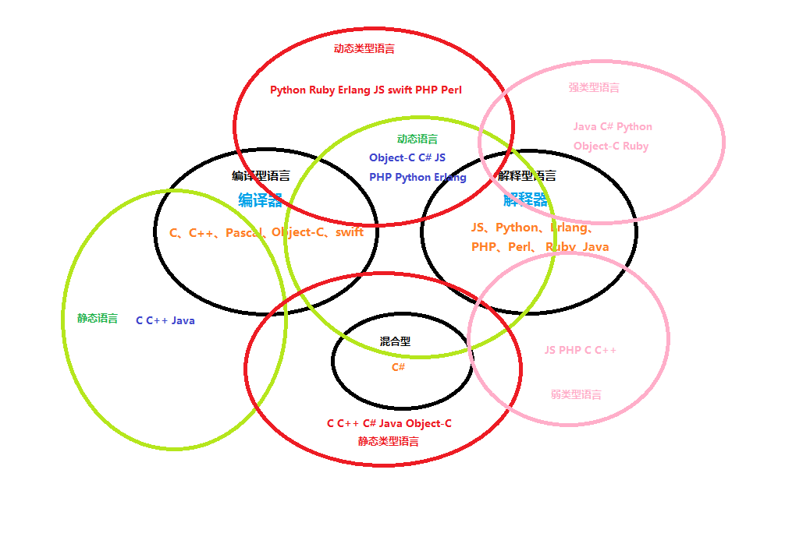

## Chapter 2

### Arithmetic productions of grammar

```haskell
<Add> ::= <Mul> | <Add> "+" <Mul> | <Add> "-" <Mul>
<Mul> ::= <Num> | <Mul> "*" <Num> | <Mul> "/" <Num>
<Par> ::= <Par> | "(" <Add>")"
<Res> ::= <Num> | <Par> "+" <Num>  |
    <Par> "-" <Num> |
    <Par> "*" <NuM> |
    <Par> "/" <Num> | ""
```

## Chapter 4




## Chapter 8

```Javascript
function toUTF8Array(str) {
    var utf8 = [];
    for (var i=0; i < str.length; i++) {
        var charcode = str.charCodeAt(i);
        if (charcode < 0x80) utf8.push(charcode);
        else if (charcode < 0x800) {
            utf8.push(0xc0 | (charcode >> 6), 
                      0x80 | (charcode & 0x3f));
        }
        else if (charcode < 0xd800 || charcode >= 0xe000) {
            utf8.push(0xe0 | (charcode >> 12), 
                      0x80 | ((charcode>>6) & 0x3f), 
                      0x80 | (charcode & 0x3f));
        }
        // surrogate pair
        else {
            i++;
            charcode = ((charcode&0x3ff)<<10)|(str.charCodeAt(i)&0x3ff)
            utf8.push(0xf0 | (charcode >>18), 
                      0x80 | ((charcode>>12) & 0x3f), 
                      0x80 | ((charcode>>6) & 0x3f), 
                      0x80 | (charcode & 0x3f));
        }
    }
    return utf8;
}
```

## Chapter 9

```Javascript
Class Human{
     hurt(damage){}
}
```

